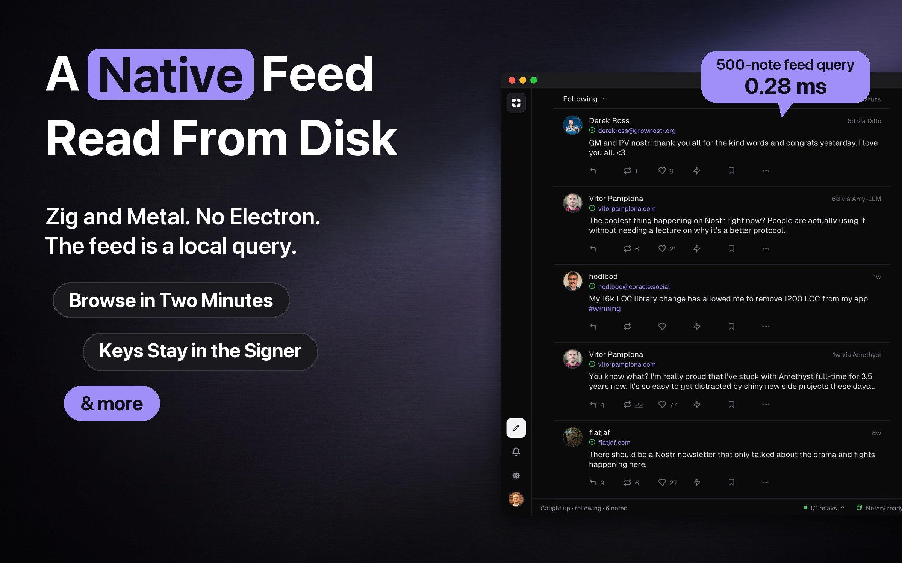
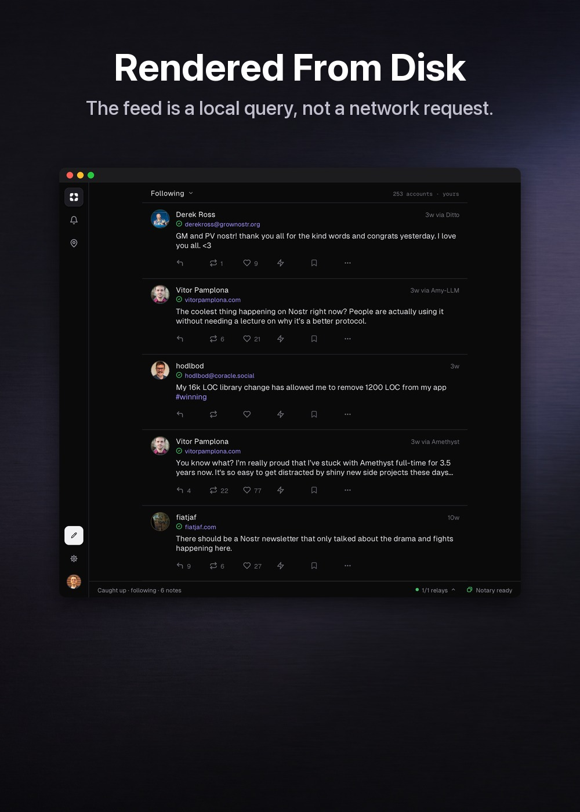
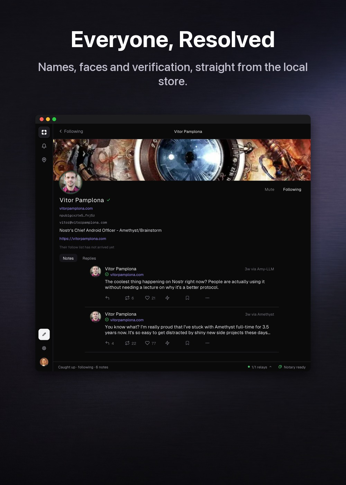
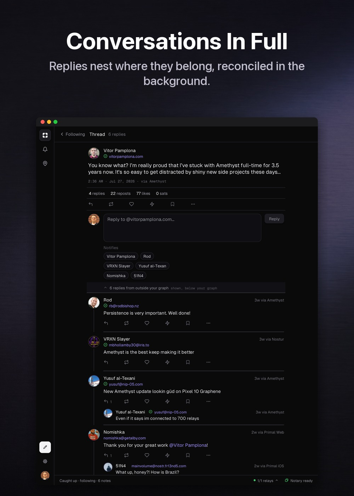

# Plaza

**A fast, local-first Nostr client, built natively in Zig.**

Plaza is the flagship app of the [zig-nostr](https://github.com/zig-nostr)
ecosystem, a native Nostr client where you read without an account and post in
four clicks, and the feed renders from disk. It's built on the
[`nostr`](https://github.com/zig-nostr/nostr) protocol library, and can sign
through [Notary](https://github.com/zig-nostr/notary) so your key never enters a
client.

> **Status: early.** A first run opens straight into a feed, signed in as
> nobody: a curated starter pack, already populated, with a strip along the top
> offering a key when you want one. Create an identity, bring an existing key, or
> connect an external signer (Notary) over NIP-46 so your key never touches the
> app. The feed carries real names, avatars and pictures,
> rendered straight from a local store that a pool of background threads keeps
> filled, one process, no IPC. Composing signs a note (locally, or by a
> round-trip to the signer) that is stored at once and published to the pool.
> Private messages land in a milestone ahead. macOS first.



## What it looks like

| | | |
| --- | --- | --- |
|  |  |  |

<sub>Real windows, photographed from the running app against real notes from
public relays. Every pixel inside the window is the app's own, so nothing here
shows a screen the app cannot draw.</sub>

## Install

```sh
curl -fsSL https://raw.githubusercontent.com/zig-nostr/plaza/main/scripts/install-macos.sh | bash
```

macOS on Apple Silicon. The installer verifies the download's SHA-256, installs
`Plaza.app`, clears the download-quarantine flag so it opens without a Gatekeeper
detour, and launches it. It touches the bundle and nothing else: your key,
session and local store live in `~/.plaza` and survive every upgrade.

Plaza is ad-hoc signed and not notarized on purpose. It signs notes with your
key, so the trust anchor is a build you can reproduce rather than an Apple
signature you cannot inspect. Read the
[installer](scripts/install-macos.sh), or build the same artifact yourself:

```sh
scripts/package-macos.sh   # -> dist/Plaza.app, ad-hoc signed
```

## Where the feed comes from

Following somebody on Nostr does not mean you will see them. If they publish
only to relays you are not connected to, they are simply absent: no error, no
empty state, nothing to say a person is missing.

Plaza reads where the people you follow actually write. It takes their NIP-65
relay lists, works out which relays reach the most of them, connects to the ones
you are not already on, and asks each relay only about the people who write
there. A small relay is asked about its dozen writers rather than about everyone
you follow. Anybody no chosen relay carries is asked of your own relays, so
nobody falls through.

Getting those lists is its own problem, because you cannot ask somebody's relays
where their relays are. Plaza asks four well-known relays that one question, and
only about the people it has no answer for. They are never joined, never
published as yours, and never counted among your eight.

The relays it picks are not the popular ones. Popularity answers "what should I
consider adding", which is a question for you. Connections answer "which relays
reach people I cannot otherwise see", and the popular relays all carry the same
crowd, so the two questions get two answers: the suggestions in settings are
ranked by how many of your follows use each relay, the connections are chosen by
who they reach.

Measured on an account following 257 people: between its own relays and the
eight it routes to, 196 of them are covered, 147 of those by two relays each, so
one relay being down does not hide anybody. It is bounded on purpose, eight
routed connections alongside the eight in your own pool, and one is only opened
while it would reach somebody not already covered twice.

Carrying people is not the same as answering, so Plaza checks the second thing
too. The relay with the most of those writers on that account is paid, and
refuses the connection itself rather than the subscription, so there is nothing
to authenticate and nothing to negotiate. A relay that will not have us after
three tries gives up its slot to the next one down and is tried again in six
hours. Before that, the same count said 202 and fifty of those people were
behind a closed door.

## Performance

The feed is a windowed list: it builds only the rows near the viewport, so what
it costs follows the window rather than the length of the feed. Measured on the
build that ships (ReleaseFast), scrolling hard through a fixed feed of 246 notes
that the harness seeds into a store of its own, so a run means the same thing
twice:

| Stage | p90 | Budget |
| --- | --- | --- |
| Rebuild | 275us | 600us |
| Layout | 1360us | 2200us |
| Patch | 55us | 150us |

A 120 Hz frame is 8333us, so a hard scroll spends about a quarter of one, and
the GPU path never falls back to CPU pixels. A long feed mounts around 460
widget nodes rather than one per note.

Timings on a shared machine only read high, never low, so the harness takes the
best of three rounds and prints the power state it measured under. Compare a
reading only against another taken in the same state.

The number that matters is that it does not move with the size of the account.
The same scroll on the same machine, before the feed stopped asking the database
who you follow once per card, cost 24423us per rebuild: three whole frames to
draw one, and worse the more people you followed.

The feed reads every account you follow, not a slice of it. At the ceiling of
2048, with each of those accounts carrying a profile older than their notes
(which is the real shape: a bio is written once and posted over ever since), a
rebuild measures 5989us against the 16667us of a 60Hz frame. The subscription
splits those authors across filters relays will accept and sends them in one
REQ, so it asks about all of them rather than the first few hundred.

That ceiling is measured by the test suite rather than by the script below:

```sh
zig build test -Doptimize=ReleaseFast
```

Measure it yourself, and fail on a regression:

```sh
scripts/frame-budget.sh
```

## Develop

```sh
native dev     # build and run with hot reload
native test    # run the test suite
native build   # produce a ReleaseFast binary in zig-out/bin/
native check   # validate the markup and manifest
```

Before a release there is a second suite, which drives a real build the way a
person drives it: a cold start filling a feed from the public internet, a
packaged bundle launched through LaunchServices, and an account's contact list
edited and read back off a relay with an independent tool.

```sh
scripts/acceptance.sh
```

It is not part of CI. It publishes signed events to public relays, so it needs a
throwaway account rather than a checkout, and it says so and skips rather than
guessing. The details are in the script.

Plaza is a [Native SDK](https://github.com/vercel-labs/native) app: plain Zig
for the logic and the feed (`src/main.zig`), declarative `.native` markup for
the static screens, rendered natively, no browser, no Electron.

### Building on Linux

There is no Linux release to install, but it builds and runs the full suite in
CI on every change, so you can build it yourself. Zig and two system libraries,
nothing else:

```sh
sudo apt-get install -y libgtk-4-dev libwebkitgtk-6.0-dev
zig build
zig build test
```

Zig **0.16.0** exactly, which is what `.zigversion` pins and what CI installs.
Everything else comes from the build: the dependencies are fetched on the first
run, and the C pieces (secp256k1, LMDB, the stb image codecs) are compiled from
source by the Zig toolchain, so there is no separate C compiler, no cmake and
nothing to install from npm. The `native` commands above are the packaging CLI
and are only needed to produce a macOS bundle.

Those two packages are what CI adds on top of the `ubuntu-latest` runner image,
which already carries a good deal. A minimal or non-Debian system may want more,
and I have not built it on one.

Worth knowing before you judge it by that build: off macOS the toolkit renders
through a software rasteriser and there is no platform text provider, so it is
slower than the packaged app and emoji come out as tofu. That is why there is no
Linux release yet rather than a rough one.

Windows is not in the matrix at all: the relay transport resolves hostnames
through libc `getaddrinfo`, which Zig's standard library does not declare for
Windows, so nothing depending on the library links there
(`zig-nostr/nostr#59`).

## License

MIT, see [LICENSE](LICENSE).
