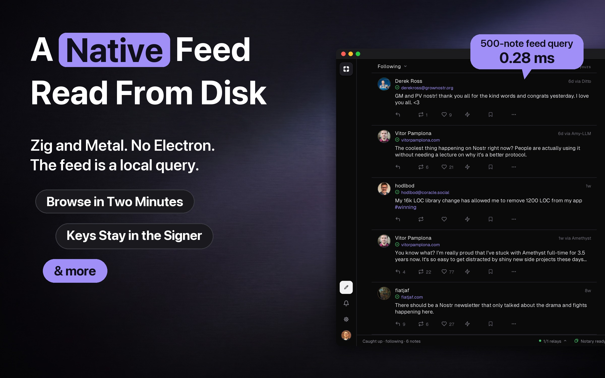
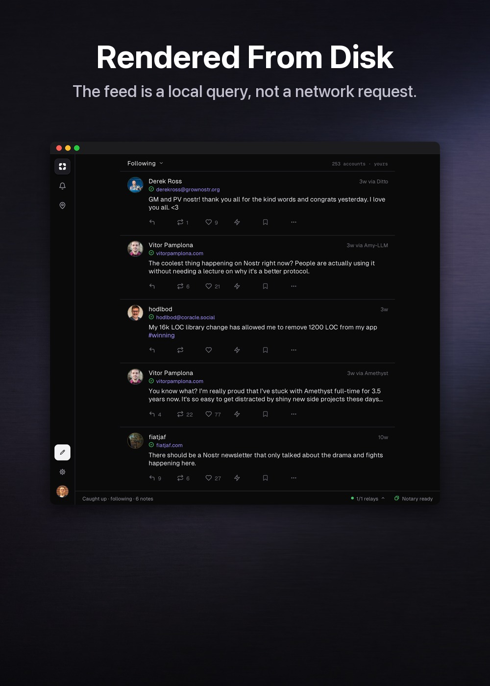
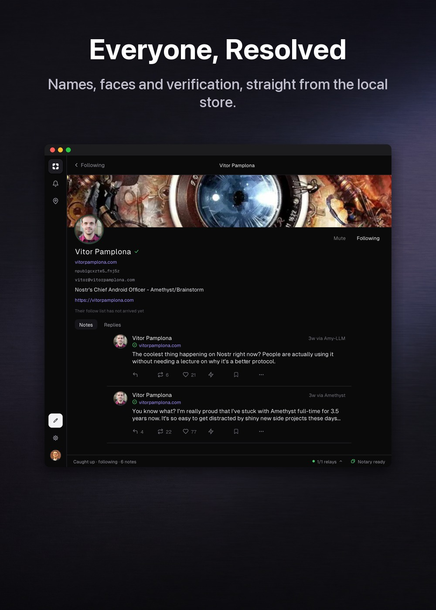
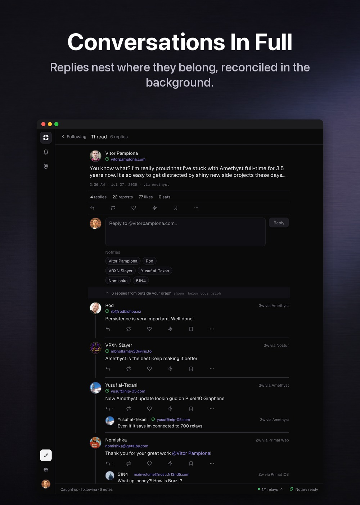
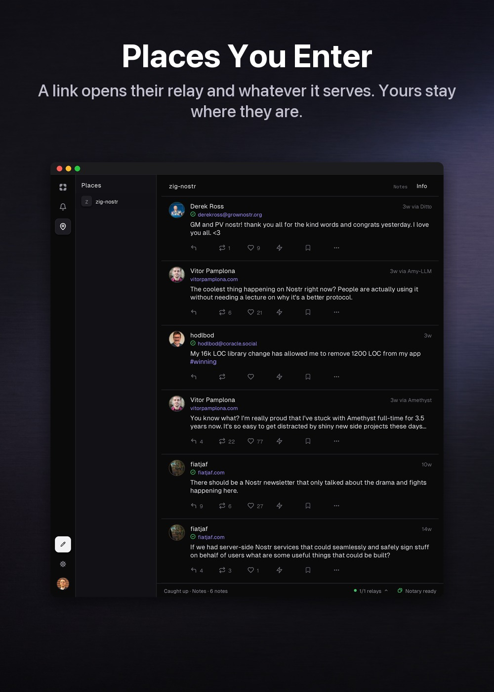

# Plaza

**A fast, local-first Nostr client, built natively in Zig.**

Plaza is the flagship app of the [zig-nostr](https://github.com/zig-nostr)
ecosystem, a native Nostr client where you read without an account and post in
four clicks, and the feed renders from disk. It's built on the
[`nostr`](https://github.com/zig-nostr/nostr) protocol library, and can sign
through [Notary](https://github.com/zig-nostr/notary) so your key never enters a
client.

> **Status: active development.** Plaza installs and runs today. It
> opens straight into a feed, signed in as nobody: nine accounts to start from,
> already populated, with a strip along the top offering a key when you want
> one. Create an identity in Notary, bring an existing key there, or connect an
> external signer over NIP-46. **Your key never enters Plaza.** There is no
> field in it that can hold one. Plaza ships Notary, starts it as its own child
> process, and asks it for signatures over a channel nothing else on the machine
> can reach, so the process decoding images and parsing relay JSON holds no
> secret and cannot be made to. The feed
> carries real names, avatars and pictures, rendered from a local store that a
> pool of background threads keeps filled, no IPC on the read path, so it is on
> screen before any relay answers. Composing signs a note (in the keyholder, or
> by a round-trip to an external signer), stores it at once and publishes it to
> the pool. Search (the magnifier in the rail, or Cmd+L) finds a person by name. The profiles already on your machine answer first, instantly and with the network off, ranked with the people you follow first and then the people who follow you. Once you stop typing, NIP-50 search relays are asked too, and each result says which relay returned it, with every relay named whether it found anyone or not. The same field takes an address, and opens what it names: an npub or nprofile, a `name@domain` NIP-05 address, a note, or a place, including one on relays you do not read, because an address that carries relay hints is asked there too. Plaza gives hints back: an address it copies, and the reply, quote, repost and like it publishes, name a relay the note was seen on or one its author writes to, and name none when it knows of none. A `plaza://place/` link
> opens somebody else's corner of Nostr: their relay, and whatever it serves,
> without disturbing your own. Plaza also says when a newer version of itself is
> out, with one press to the release page. It tells you rather than replacing
> itself, and the check can be switched off in Settings, after which it makes no
> request at all.
>
> A video in a note is drawn as a video rather than as a web page, though it is
> not played in place yet.
>
> A picture can go into a note, or be set as an avatar or a banner. It is uploaded to a Blossom media server: the first in your published server list that takes it, or one of two built in when you have none. A card names the server and waits for a press before anything is sent, and the location and camera details in the file are removed first, comments and XMP included for a GIF. Settings lists the servers and edits the list.
>
> A note whose author marked it sensitive (NIP-36) is covered by one line, the reason when there is one and a Show press that uncovers that note for the session. Its pictures, its link preview and the picture of any note it quotes are not fetched until you press Show, and an article with a warning is covered the same way. "Show sensitive notes without a warning" in Settings turns the covering off, and the composer can add a warning with an optional reason to a note you write.
>
> A long-form article (NIP-23) opens in a reader of its own: the byline, title, summary and cover, then the body. An `naddr` for an article, in a note, in a quote or in the search field, opens it. A draft is not opened, and Plaza reads articles without writing them.
>
> A relay that asks who you are (NIP-42) gets an answer only after it has refused something for want of one, and only if you have said yes. Allow or Don't allow is asked once per relay for each account. Once a relay has asked or been answered, its row in Settings carries a badge (ask first, identify or anonymous), and pressing the badge changes the choice. A relay that only sends a challenge and gates nothing is never asked about.
>
> A quote card draws the picture of the note it quotes. The rows and controls that answer a click can be reached with Tab and pressed with Return or Space.
>
> Pictures, avatars, banners and a place's logo are fetched only from a public address, never from a host on your own network. With the media proxy on, they are asked of the proxy, and go direct only when it refuses a host and "Ask the host when the proxy refuses" is on. A relay address taken from somebody else's note, relay list or place is dialled only when it is public.
>
> Not there yet: playing a video where it sits, sending a zap, searching notes, and private messages.



## What it looks like

| | | | |
| --- | --- | --- | --- |
|  |  |  |  |

<sub>Real windows, photographed from the running app against real notes from
public relays. Every pixel inside the window is the app's own, so nothing here
shows a screen the app cannot draw.</sub>

## Install

```sh
curl -fsSL https://raw.githubusercontent.com/zig-nostr/plaza/main/scripts/install-macos.sh | bash
```

macOS on Apple Silicon. The installer verifies the download's SHA-256, installs
`Plaza.app`, clears the download-quarantine flag so it opens without a Gatekeeper
detour, and launches it. It touches the bundle and nothing else: your session
and local store live in `~/.plaza`, your key stays in Notary, and both survive
every upgrade.

Plaza is ad-hoc signed and not notarized on purpose. It signs notes with your
key, so the trust anchor is a build you can reproduce rather than an Apple
signature you cannot inspect. Read the
[installer](scripts/install-macos.sh), or build the same artifact yourself:

```sh
scripts/package-macos.sh   # -> dist/Plaza.app, ad-hoc signed
```

### Linux

```sh
curl -fsSL https://raw.githubusercontent.com/zig-nostr/plaza/main/scripts/install-linux.sh | bash
```

x86_64 and aarch64, on a reasonably recent distribution: **Ubuntu 23.10+, Debian
13+, or Fedora 39+**. The toolkit's Linux host declares a GTK floor of 4.10 and
the binaries are built against glibc 2.38, which land on the same generation, so
Ubuntu 22.04 and Debian 12 are too old. The installer checks that before it
downloads anything, rather than leaving you with a loader error after a
successful-looking install. Building from source on an older system works if its
GTK is 4.10 or newer.

GTK 4 is the one runtime dependency, and the installer says so before it
downloads anything rather than after the window fails to open. It verifies the
SHA-256, installs into `~/.local` so nothing needs root and nothing lands
outside your home directory, registers the desktop entry so `plaza://` links
open Plaza, and launches it. Pass `--archive <file>` to install a tarball you
already have, which needs no network.

Off macOS there is no system text layer, so Plaza draws every glyph itself, from
faces it carries: Geist for Latin and Cyrillic, a colour emoji face, and Noto
for Greek, Japanese, Chinese and Korean. Arabic, Hebrew, Thai and Devanagari are
still not right, and a font would not fix them: they need letters to join and
reorder, and the renderer has no shaping.

```sh
scripts/package-linux.sh --notary <path>   # -> dist/plaza-<version>-linux-<arch>.tar.gz
```

## What it speaks

Each line says how far Plaza goes with the protocol, so a NIP named here is supported to that extent and no further.

| | Plaza |
| --- | --- |
| NIP-02 | Reads the people you follow from your contact list (kind 3), and Follow and Unfollow publish it back with everything else in it kept as it was. |
| NIP-05 | Verifies a profile's `name@domain`, and the search field resolves one to the person it names. |
| NIP-09 | Taking back a like publishes a deletion request (kind 5) for it. Nothing else is deleted. |
| NIP-10 | Reads reply threads by their markers, and writes a reply with a `root` marker and a relay hint when it knows one. |
| NIP-18 | Reposts (kinds 6 and 16) are read, and shown in the feed as the note itself. Plaza publishes a repost with the note's relay hint, and a quote as a `q` tag. |
| NIP-19 | Opens `npub`, `nprofile`, `note`, `nevent` and `naddr`. An address it copies carries up to two relay hints, and the account menu copies an `nprofile`. |
| NIP-22 | Reads a comment (kind 1111) as a reply in a thread and in notifications. A reply Plaza writes is a kind 1 note, not a comment. |
| NIP-23 | Reads a long-form article (kind 30023) in full and opens one from an `naddr`. It does not open a draft (kind 30024) and does not write articles. |
| NIP-25 | Likes are published with the relay hint in the `e` and `p` tags. |
| NIP-27 | A `nostr:` reference to a person is shown as the name, and the first reference to a note or an article becomes a quote card. A quote you write is composed as one. |
| NIP-36 | Covers a note that carries a `content-warning` tag, and adds the tag to a note when you ask. |
| NIP-42 | Answers a relay's AUTH challenge when you have allowed it for that relay, as described above. |
| NIP-44 | The private half of a mute or bookmark list is opened and sealed by the signer. A half written with NIP-04 is opened only through an external signer. |
| NIP-46 | Signs through an external signer paired with a `bunker://` link. |
| NIP-50 | Asks three search relays for people by name. It searches profiles only, not notes. |
| NIP-51 | Reads and writes your mute list (kind 10000) and your bookmarks (kind 10003), public and private. A list Plaza could not read is never written over. |
| NIP-57 | Shows a note's zap total and lists the zaps sent to you, checking the request inside each receipt. It does not send a zap and does not check a receipt against the recipient's LNURL server. |
| NIP-65 | Reads where the people you follow write, and publishes your own relay list. |
| NIP-89 | Adds a `client` tag to a note or repost you publish only when you turn that on in Settings. It is off by default. |
| NIP-92 | Reads `imeta` for a picture's shape and placeholder, and writes it for a picture it uploads (url, type, hash, size, dimensions, blurhash and description). |
| Blossom | Uploads a picture with BUD-02, signs the BUD-11 token, checks a server first with BUD-06 and reads your BUD-03 server list (kind 10063). |

## Where the feed comes from

Following somebody on Nostr does not mean you will see them. If they publish
only to relays you are not connected to, they are simply absent: no error, no
empty state, nothing to say a person is missing.

Plaza reads where the people you follow actually write, which is the pattern
people call the outbox model. It takes their NIP-65 relay lists, works out which
relays reach the most of them, connects to the ones you are not already on, and
asks each relay only about the people who write there. A small relay is asked
about its dozen writers rather than about everyone you follow. Anybody no chosen
relay carries is asked of your own relays, so nobody falls through.

Getting those lists is its own problem, because you cannot ask somebody's relays
where their relays are. Plaza asks four well-known relays that one question, and
only about the people it has no answer for. They are never joined, never
published as yours, and never counted among your eight.

The relays it picks are not the popular ones. Popularity answers "what should I
consider adding", which is a question for you. Connections answer "which relays
reach people I cannot otherwise see", and the popular relays all carry the same
crowd, so the two questions get two answers: the suggestions in settings are
ranked by how many of your follows use each relay, the connections are chosen by
who they reach.

Measured on an account following 257 people: between its own relays and the
eight it routes to, 196 of them are covered, 147 of those by two relays each, so
one relay being down does not hide anybody. It is bounded on purpose, eight
routed connections alongside the eight in your own pool, and one is only opened
while it would reach somebody not already covered twice.

Carrying people is not the same as answering, so Plaza checks the second thing
too. The relay with the most of those writers on that account is paid, and
refuses the connection itself rather than the subscription, so there is nothing
to authenticate and nothing to negotiate. A relay that will not have us after
three tries gives up its slot to the next one down and is tried again in six
hours. Before that, the same count said 202 and fifty of those people were
behind a closed door.

## Make it quiet

Which parts of Nostr are worth your attention is your call, not mine. Settings
has eight switches that take things away: replying, reposting, reacting,
zapping, and the count beside each one.

Hiding is not covering up. Turn off reactions and Plaza stops asking relays for
them. The subscription drops kind 7, those events never arrive, and that is less
to download, less to parse and less sitting on your disk. A hidden thing is
absent rather than painted over.

Two of the eight are honest exceptions, and the switch says so where you flip
it. Your own reposts arrive in the same stream as everybody else's, so hiding
the repost verb changes what is drawn and nothing more. Claiming the data was
gone would be easy and untrue.

Notifications are a separate subscription and keep their own. Hide reaction
counts in the feed and you will still hear when somebody likes your note.

## Places

A place is somebody's corner of Nostr: their relays, and what those relays
serve. A `plaza://place/` link opens the one it names, and while you are in it
you are reading that rather than your own feed. Your own relays are left alone,
and leaving puts you back where you were.

You arrive as a visitor and can read and post straight away. Entering keeps the
place on a rail down the side of the window, one press away from then on, and
leaving takes it off again. Nothing is gated on entering, posting included:
whether a post lands is between you and that place's relays.

A community can carry several feeds. The one you are reading names itself in the
header, and where there is more than one that name is the switcher. A place that
states a colour wears it: the accent, and the handles, mentions and links in its
feed, in the colour that community chose rather than Plaza's own violet. What
does not move is anything that means a state: a warning, a zap, an unread
mark. A yellow room should not make an error look like weather.

Arriving opens the host's own text once, in a card you can close and find again
under Info.

An address or link for a place that no relay turns up says so once the wait is over, and one whose event turns out not to be a place document says that instead. A place that states no feed says so in the room instead of waiting to connect.

The format is fiatjaf's Hallway universe object and the field names are his
exactly, so a document written for one is read the same way by the other. The
two do not yet share a publishing path: Hallway's deployer ships a site, and
Plaza reads a `kind:30078` carrying that same object.

## Performance

The feed is a windowed list: it builds only the rows near the viewport, so what
it costs follows the window rather than the length of the feed. Measured on the
build that ships (ReleaseFast), scrolling hard through a fixed feed of 240 notes
that the harness seeds into a store of its own, so a run means the same thing
twice:

| Stage | p90 | Budget |
| --- | --- | --- |
| Rebuild | 275us | 600us |
| Layout | 1360us | 2200us |
| Patch | 55us | 150us |

A 120 Hz frame is 8333us, so a hard scroll spends about a quarter of one, and
the GPU path never falls back to CPU pixels. A long feed mounts around 460
widget nodes rather than one per note.

**These are macOS numbers, and they do not describe the Linux build.** macOS is
the only platform where the toolkit registers a GPU presenter, so a frame there
is a Metal packet; on Linux the same frame is rasterised in software and handed
to GTK as a buffer of pixels, and the present path converts and repaints the
whole window rather than the part that changed. Rebuild and layout above are
platform-independent work and hold either way. Paint and present do not, and are
not measured on Linux at all.

Timings on a shared machine only read high, never low, so the harness takes the
best of three rounds and prints the power state it measured under. Compare a
reading only against another taken in the same state.

The number that matters is that it does not move with the size of the account.
The same scroll on the same machine, before the feed stopped asking the database
who you follow once per card, cost 24423us per rebuild: three whole frames to
draw one, and worse the more people you followed.

The feed reads every account you follow, not a slice of it. At the ceiling of
2048, with each of those accounts carrying a profile older than their notes
(which is the real shape: a bio is written once and posted over ever since), a
rebuild measures 5989us against the 16667us of a 60Hz frame. The subscription
splits those authors across filters relays will accept and sends them in one
REQ, so it asks about all of them rather than the first few hundred.

That ceiling is measured by the test suite rather than by the script below:

```sh
zig build test -Doptimize=ReleaseFast
```

Measure it yourself, and fail on a regression:

```sh
scripts/frame-budget.sh
```

## Develop

```sh
native dev     # build and run with hot reload
native test    # run the test suite
native build   # produce a ReleaseFast binary in zig-out/bin/
native check   # validate the markup and manifest
```

Before a release there is a second suite, which drives a real build the way a
person drives it: a cold start filling a feed from the public internet, a
packaged bundle launched through LaunchServices, and an account's contact list
edited and read back off a relay with an independent tool.

```sh
scripts/acceptance.sh
```

It is not part of CI. It publishes signed events to public relays, so it needs a
throwaway account rather than a checkout, and it says so and skips rather than
guessing. The details are in the script.

Plaza is a [Native SDK](https://github.com/vercel-labs/native) app: plain Zig
for the logic and the feed (`src/*.zig`), declarative `.native` markup for
the static screens, rendered natively, no browser, no Electron.

### Building on Linux

There is a Linux release now, above. If you would rather build it, that is Zig
and one system library and nothing else, and CI builds and runs the full suite
on every change:

```sh
sudo apt-get install -y libgtk-4-dev
zig build
zig build test
```

Zig **0.16.0** exactly, which is what `.zigversion` pins and what CI installs.
Everything else comes from the build: the dependencies are fetched on the first
run, and the C pieces (secp256k1, LMDB, the stb image codecs) are compiled from
source by the Zig toolchain, so there is no separate C compiler, no cmake and
nothing to install from npm. The `native` commands above are the packaging CLI
and are only needed to produce a macOS bundle or a Linux tarball.

Those two packages are what CI adds on top of the `ubuntu-latest` runner image,
which already carries a good deal. A minimal or non-Debian system may want more,
and I have not built it on one.

Worth knowing before you judge it by that build: off macOS the toolkit renders
through a software rasteriser and there is no platform text provider, so it is
slower than the packaged app. Emoji are drawn from a colour face Plaza bundles
there rather than from the system, which is why the Linux build carries a font
the macOS one does not.

No platform text provider also means no font fallback for free. macOS asks
CoreText for a glyph its face does not have and gets one; off macOS there is
nobody to ask, so a codepoint outside the bundled faces is painted as a solid
block. Geist covers Latin and Cyrillic (its Greek is four maths symbols), so
everything else used to be blocks. Plaza now carries Noto Sans, Noto Sans SC and
the hangul of Noto Sans KR, and the renderer asks them for a codepoint Geist
does not have. That is 13 MB of font in the Linux build and none in the macOS
one, which is most of the size difference between them.

Coverage was one of two problems. The other is shaping, and no font fixes it:
the reference rasteriser reads no GSUB or GPOS and there is no bidi, so Arabic
comes out unjoined and left to right, and Devanagari and Thai unreordered. No
face is bundled for those, because a wrong rendering is not obviously better
than a missing one.

Windows is not in the matrix. The `nostr` library builds for it as of v0.14.8, so that is no longer what stops it, but Plaza itself has not been built or tested there and there is no Windows release.

## License

MIT, see [LICENSE](LICENSE).
